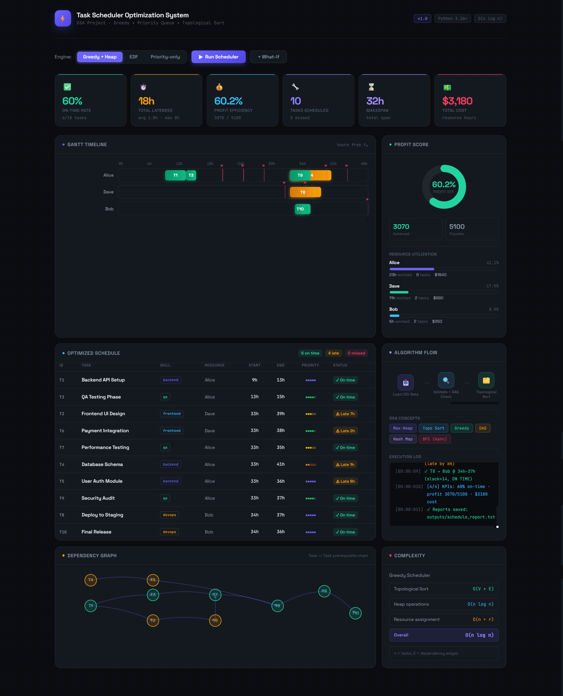
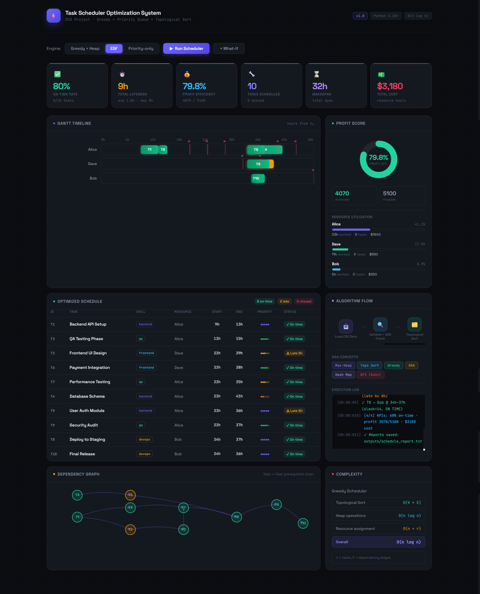
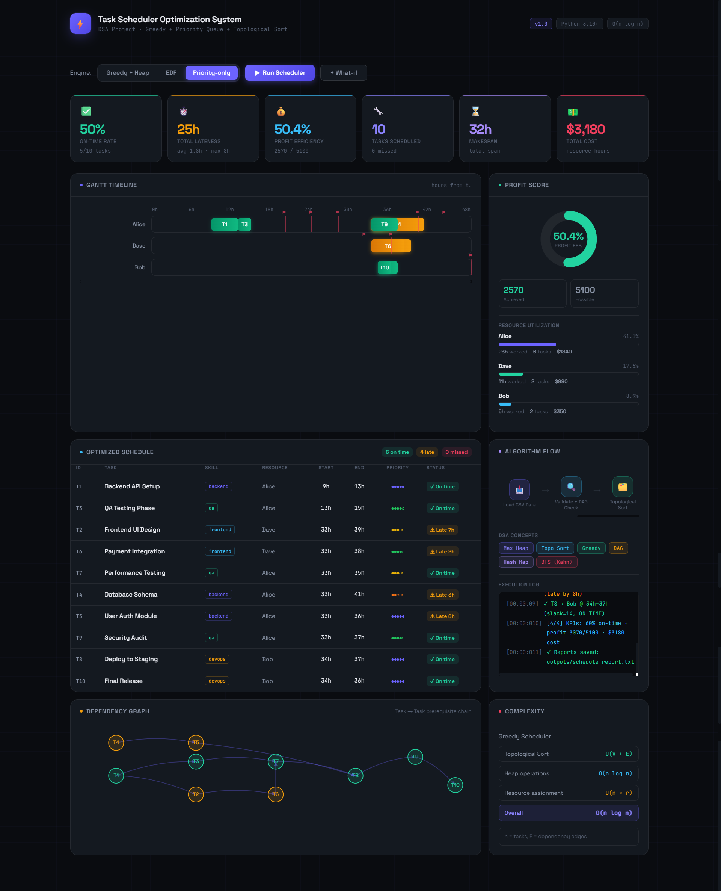
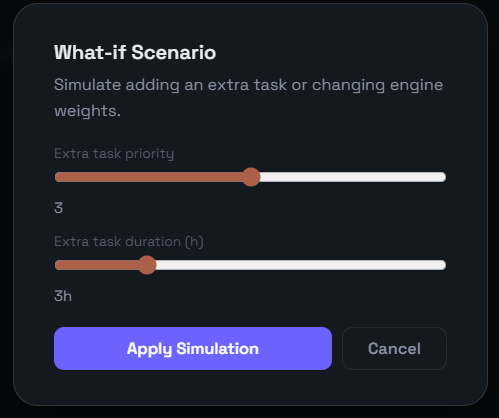
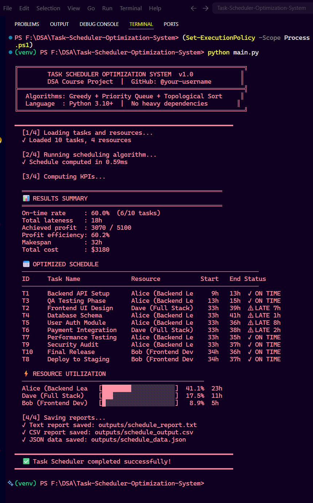

# ⚡ Task Scheduler Optimization System

> A constraint-aware task scheduler using **Greedy Algorithm + Priority Queue (Max-Heap) + Topological Sort (Kahn's BFS)** — built as a DSA course project with a production-quality interactive dashboard.


-green?style=flat-square)


---

## 📋 Problem Statement

Given a set of tasks with **priorities, deadlines, durations, skill requirements, and dependencies**, and a set of resources with **skills, shift windows, and capacities** — find the optimal assignment that:

- ✅ Minimizes total lateness
- ✅ Respects task dependencies (DAG)
- ✅ Assigns only skilled resources
- ✅ Honors shift windows
- ✅ Maximizes profit/score

This problem models real systems like **CPU schedulers, cloud job queues, sprint planners, and field-service routing**.

---

## 🧠 DSA Concepts Used

| Concept | Where Used | Complexity |
|---|---|---|
| **Max-Heap / Priority Queue** | `heapq` — selecting next task by priority | O(log n) per op |
| **Topological Sort (Kahn's)** | BFS over dependency DAG | O(V + E) |
| **Greedy Algorithm** | Best resource assignment at each step | O(n × r) |
| **Hash Map / Dict** | Task lookup, earliest-end tracking | O(1) |
| **DAG (Directed Acyclic Graph)** | Dependency modelling | O(V + E) |
| **Adjacency List** | Dependency graph representation | O(E) space |
| **Cycle Detection (DFS)** | Validate no circular dependencies | O(V + E) |

**Overall: O(n log n)** — Dominated by heap operations.

---

## 🏗️ Architecture

```
Task Input (CSV)
      │
      ▼
┌─────────────────────────────────────────┐
│  data_loader.py                         │
│  • Parse CSV → Task & Resource objects  │
│  • Validate data, detect cycles (DFS)   │
└──────────────────┬──────────────────────┘
                   │
                   ▼
┌─────────────────────────────────────────┐
│  greedy_scheduler.py                    │
│  1. Build dependency adjacency list     │
│  2. Kahn's topological sort (BFS heap)  │
│  3. For each task in topo order:        │
│     - Find earliest feasible slot       │
│     - Score resources (lateness-based)  │
│     - Assign to best resource           │
└──────────────────┬──────────────────────┘
                   │
                   ▼
┌─────────────────────────────────────────┐
│  metrics.py                             │
│  • On-time %, total lateness            │
│  • Profit efficiency, resource util     │
└──────────────────┬──────────────────────┘
                   │
                   ▼
┌─────────────────────────────────────────┐
│  report_generator.py                    │
│  • Text report (.txt)                   │
│  • Schedule output (.csv)               │
│  • Full data (.json)                    │
└─────────────────────────────────────────┘
                   │
                   ▼
        dashboard.html  (Interactive UI)
```

---

## 📁 Folder Structure

```
Task-Scheduler-Optimization-System/
│
├── data/
│   ├── tasks.csv           # Task definitions (ID, deadline, priority, skill, deps)
│   └── resources.csv       # Resource pool (skills, shifts, cost)
│
├── src/
│   ├── __init__.py
│   ├── models.py           # Task, Resource, ScheduleResult dataclasses
│   ├── data_loader.py      # CSV parsing + validation + cycle detection
│   ├── greedy_scheduler.py # Core algorithm: Topo Sort + Heap + Greedy
│   ├── metrics.py          # KPI computation (on-time %, profit, utilization)
│   └── report_generator.py # Text/CSV/JSON report generation
│
├── outputs/
│   ├── schedule_report.txt # Generated human-readable report
│   ├── schedule_output.csv # Machine-readable schedule
│   └── schedule_data.json  # Full JSON for API/dashboard
│
├── docs/
│   └── ARCHITECTURE.md     # System design notes
│
├── dashboard.html          # ⭐ Interactive web dashboard (open in browser)
├── main.py                 # CLI entry point
├── requirements.txt        # Minimal dependencies
├── .gitignore
└── README.md
```

---

## 🚀 Installation & Running

### Prerequisites
- Python 3.10+ (standard library only — no pip needed for greedy mode!)

### Run CLI Scheduler

```bash
# Clone / navigate to project
cd Task-Scheduler-Optimization-System

# Run with defaults (greedy, 168h horizon)
python main.py

# Explicit options
python main.py --engine greedy --horizon 72

# Skip saving output files
python main.py --no-report

# Custom data paths
python main.py --tasks data/tasks.csv --resources data/resources.csv
```

### View Interactive Dashboard

```bash
# Simply open in browser (no server needed)
open dashboard.html          # macOS
start dashboard.html         # Windows
xdg-open dashboard.html      # Linux
```

---

## 📊 Sample Output

```
╔══════════════════════════════════════════════════════════════╗
║        TASK SCHEDULER OPTIMIZATION SYSTEM  v1.0             ║
╚══════════════════════════════════════════════════════════════╝

  [1/4] Loading tasks and resources...
  ✓ Loaded 10 tasks, 4 resources

  [2/4] Running scheduling algorithm...
  ✓ Schedule computed in 0.57ms

  ═══════════════════════════════════════════════════════
  📊 RESULTS SUMMARY
  ═══════════════════════════════════════════════════════
  On-time rate     : 60.0%  (6/10 tasks)
  Total lateness   : 18h
  Achieved profit  : 3070 / 5100
  Profit efficiency: 60.2%
  Makespan         : 32h
  Total cost       : $3180

  📅 OPTIMIZED SCHEDULE
  ─────────────────────────────────────────────────────────────────
  ID     Task Name              Resource           Start   End Status
  T1     Backend API Setup      Alice (Backend Le     9h   13h  ✓ ON TIME
  T3     QA Testing Phase       Alice (Backend Le    13h   15h  ✓ ON TIME
  T7     Performance Testing    Alice (Backend Le    33h   35h  ✓ ON TIME
  T8     Deploy to Staging      Bob (Frontend Dev    34h   37h  ✓ ON TIME
  T9     Security Audit         Alice (Backend Le    33h   37h  ✓ ON TIME
  T10    Final Release          Bob (Frontend Dev    34h   36h  ✓ ON TIME
  T2     Frontend UI Design     Dave (Full Stack)    33h   39h  ⚠ LATE 7h
  T4     Database Schema        Alice (Backend Le    33h   41h  ⚠ LATE 1h
  T5     User Auth Module       Alice (Backend Le    33h   36h  ⚠ LATE 8h
  T6     Payment Integration    Dave (Full Stack)    33h   38h  ⚠ LATE 2h
```

---

## 🎯 Algorithm: How It Works

### Step 1 — Topological Sort (Kahn's BFS + Heap)
```python
# Build in-degree count and adjacency list
for task in tasks:
    for dep in task.depends_on:
        in_degree[task.task_id] += 1
        children[dep].append(task.task_id)

# Initialize heap with tasks that have no dependencies
# Heap key: (-priority, deadline, task_id) — max-heap behavior
heap = [(-t.priority, t.deadline, t.task_id)
        for t in tasks if in_degree[t.task_id] == 0]
heapq.heapify(heap)

# Process: pop best task → reduce children's in-degree → add ready ones
while heap:
    _, _, tid = heapq.heappop(heap)
    topo_order.append(tid)
    for child in children[tid]:
        in_degree[child] -= 1
        if in_degree[child] == 0:
            heapq.heappush(heap, (-lookup[child].priority, ...))
```

### Step 2 — Greedy Resource Assignment
```python
for tid in topo_order:
    dep_end = max(earliest_end[dep] for dep in task.depends_on)
    best = None

    for resource in resources:
        if not resource.can_handle(task.skill):
            continue
        start = max(resource.current_time, dep_end, shift_start)
        if start + task.duration <= shift_end:
            lateness = max(0, (start + task.duration) - task.deadline)
            score = lateness * 100 - task.priority * 20  # lower = better
            if score < best_score:
                best = (resource, start)

    assign(task, best)
```

---

## 🖼️ Screenshots to Capture for GitHub

## Screenshots

### 🟢 Greedy & Heap



### 🟢 EDF



### 🟢 Priority



### 🟢 Simulation



### 🟢 Terminal



---

## 📚 Learning Outcomes

- ✅ Implemented **Max-Heap** for O(log n) task selection
- ✅ Built **Kahn's Algorithm** for topological ordering with BFS
- ✅ Applied **Greedy technique** with multi-objective scoring
- ✅ Modelled tasks as a **Directed Acyclic Graph (DAG)**
- ✅ Practiced **Cycle Detection** using DFS on the dependency graph
- ✅ Generated structured **CSV/JSON reports** programmatically
- ✅ Built an interactive **HTML dashboard** for visualization

---

## 🔗 GitHub Setup

```bash
git init
git add .
git commit -m "feat: initial Task Scheduler Optimization System"
git remote add origin https://github.com/YOUR_USERNAME/task-scheduler-optimization
git branch -M main
git push -u origin main
```

**Recommended repo name:** `Task-Scheduler-Optimization-System`  
**Topics/tags:** `dsa`, `algorithms`, `greedy`, `priority-queue`, `scheduling`, `python`, `topological-sort`, `graph-algorithms`, `course-project`

---

## 📈 Extensions (Advanced)

- **CP-SAT Solver**: Add `ortools` for globally optimal solutions
- **FastAPI Backend**: Expose `/solve` and `/whatif` REST endpoints
- **Rolling Horizon**: Re-optimize every N hours as tasks arrive
- **Multi-skill Tasks**: Allow tasks requiring 2+ skills simultaneously
- **Gantt Export**: Save timeline as PNG using `matplotlib`

---

## 👨‍💻 Author

Amiya Krishna Chaurasiya

B.Tech CSE Student

Aspiring Data Scientist and AI/ML Engineer

GitHub: https://github.com/Amiya-Krishna

LinkedIn: https://www.linkedin.com/in/amiya-krishna

## ⭐ Support

If you like this project:

⭐ Star the repository
🍴 Fork it
🤝 Contribute

---

*Built with ❤️ as a DSA Course Project · Demonstrates: Heaps, Graphs, Greedy Algorithms, and System Design*
